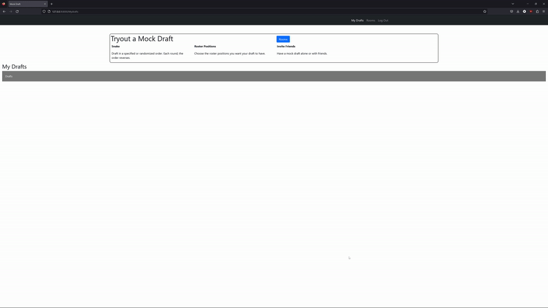
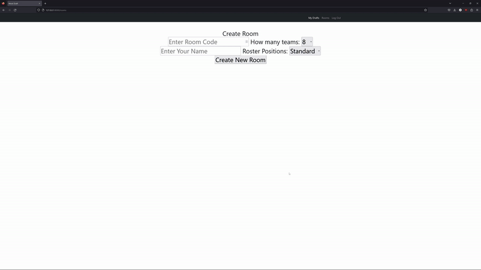
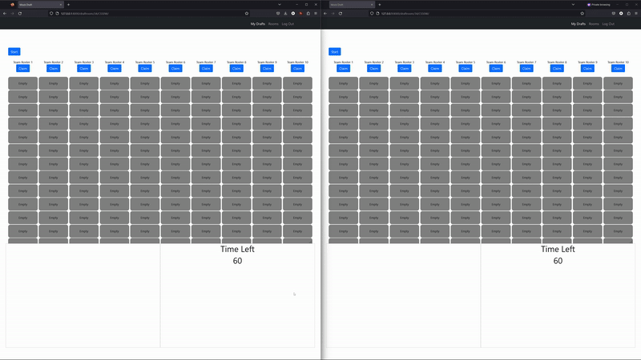

# CS50W Capstone
For this project I created a fantasy sports mock draft simulator to help me prepare for my fantasy football leagues. I have played fantasy football for years, and I have always wanted to perfect my drafting strategy to maximize my win potential. The problem with most mock draft simulators is that they are "one size fits all", meaning that they treat every group of people the same. In real life, everyone has different draft strategies, and in this application, I find that I can better simulate my fantasy leagues' drafting strategies by uploading a custom list that the AI will end up drafting from.

Creating this project required me to use HTML, CSS, Bootstrap, Javascript, Python, and the framework Django. To make my application function with interacting users, I had to learn Django Channels as well. Considering that this was the first time I had been introduced with Django Channels, there was a lot of trial and error involved. However, I believe I made the right choice in the end.

After settling on the technologies and languages I was going to use, I decided that my first objective would be to upload my rankingslist into the database (details on how I uploaded the list can be found in the "How To Run" section of the README). This list would prove to be the foundation which the primary function of my app would operate on. Once I had the list uploaded, I could use it to display a recommended draft selection to the user, as well as give my AI a recommended list to draft from. To display this information to the user, I used javascript to make a fetch request to my player_list() function in views.py.

Once I uploaded the list, what followed was the standard Django proceedure I have grown accustomed to. I created my classes in models.py, defined my functions in views.py, and relayed the information for my html and javascript to display. To this moment, all of our applications in CS50W have only functioned in realtime for a single user through javascript. However, whenever another user made a change, the results could only been seen after a page refresh. For an interactive game like fantasy sports, drafting against AI all the time will probably not be beneficial to you by the time the real draft comes along. Knowing this, I knew that I could not build this application the same way I had previously made applications in this class. This is where my introduction to Django Channels started and where the hard part began.

First, I wanted the user to be able to claim their team/drafting position from the list of available teams determined by the user who created the room. To do this, using javascript I attached a button to each team that, upon being clicked, would send four variables titled "message", "roomid", "username", and "command" to the Channels socket or consumers.py. Infact, every button on this page would send the same four variables, just with different values. Then, consumers.py would run a multitude of if statements based on what "command" was equal to. In this case, "command" would be equal to "claim" which would trigger the if statement to store the new owner of the team in the model Teams(). The information would be stored based on the values found in "roomid" and "username". After claiming a team, the javascript would then prevent the user from claiming a different one by checking to see if the user already owned a team. Once everyone was ready, you could click the start button to start the draft.

If the draft starts and the first team or first few teams are not claimed by a user, those teams will instantly have their picks auto drafted. Those picks happen the moment the start button is clicked. When consumers.py receives the four variables sent by the start button, the final if/else statement is triggered. This statement cycles through the list of owners, and drafts for them until we get to an owner that is not named "AI". These picks are made by having consumers.py access data from the req_position field from model Teams(). This field contains a list of required positions for each team that would get crossed off the list once the position had been satisfied. consumers.py would use this information to then exclude any position already satisfied from the list of available players, which is found in the model Rankings(). With the newly filtered list, one in the top ten available players will be randomly selected and added to the team. Once a player is drafted, the model for Drafted() is updated to include the latest pick. For every future pick, the list of available players filters out the players that have been already drafted.

Next, its the user's turn to draft. The user will now be able to click "draft" buttons next to their desired player that were not available prior to their turn. When it is the turn of someone who is not an AI, consumers.py sends back a variable called "turn", which lets javascript know who's turn it is to draft. After every auto picking session, the user who's turn it is to pick is sent back to javascript, which then allows that user to draft. Upon clicking the draft button, the four variables are sent again. This time "message" is equal to the player just drafted, and "command" is equal to "draft". The "draft" command triggers an if statement in consumers.py to record the user's pick, update the team info, and add the draft pick to the Drafted() model. Like the auto drafting that potentially happens at the beginning of the draft, the auto drafting happens again until the next user's turn. However, the standard draft format follows a "snake" model. This means that each round, the order reverses. So, once the last team each round drafts, consumers.py flips the draft order and cycles through the teams again. Depending on how many rounds there are and the round the draft is currently in, consumers.py knows which direction to auto draft in (the draft order is either normal or reversed depending on an odd or even round).

Additionally, the user has 60 seconds to make each pick, which can be seen by the timer on the bottom right corner of the page (draftroom.html). The timer works by utilizing a counter in javascript that starts at 60 and subtracts 1 in second intervals. In addition to this, the moment the timer starts, the javascript makes a fetch request to the timer() function to record the exact moment in time using python's time module. Every two seconds the javascript makes a fetch request to timer() verify how much time has passed. Once a player is drafted, the timer automatically resets for the user who made the pick through javascript. However, for other users, their timer is only reset once the page receives new information from the timer() fetch request. When a draft pick is made, consumers.py is told to reset the time passed to zero. timer() then relays the info back to javascript and resets the clock for everyone else. If the time runs out before a player is drafted, the user has their pick auto drafted. When the timer hits zero, the javascript sends the four variables back with "command" equaling "autodraft". consumers.py uses the if statement associated with the "command" to autodraft for the user in a similar way that it autodrafts for the rest of the AI.

The last essential part of the code is the alert that triggers when trying to reload the page. If for whatever reason you had to disconnect from the draft, upon reloading you will receive an alert that lets you know you are rejoining. This is important because it forces the user to interact with the page, which connects the user to the receive() portion of consumers.py. To this point, receive() has been responsible for relaying all the information to the page. Admittedly, there is likely a better way of handling this, however this was my solution to the problem with my limited time with Django Channels.

# Distinctiveness and Complexity
Much of what I will say here was covered in depth in the section above. What makes my this project distinct and more complex is the use of Django Channels and my implementation of an AI. Both are unique concepts that have not been introduced to the class at this point. Unlike the other projects we have worked on, the functionality of this app is contingent on interactions with other users in real time. Django Channels allowed me to update the page with any change that happened to the database. So, I combined the knowledge I have gained from our other projects, and combined it with the use of Django Channels as well. As for the AI, I had to work out this idea completely from scratch. I decided to use the random module to have the AI pick at random from the top 10 players available. However, I also had to make sure that the players the AI were selecting from were not already drafted, the positions of players drafted were not already filled, and all required positions were fulfilled. Additionally, I had to make sure that the AI always drafted in the right order by making the draft order flip every time we got to the last team to draft.

# Layout (layout.html)
My website utilizes a bootstrap navbar on every page with buttons to login/logout, register, view your drafts ("My Drafts"), and create a new draft room ("Rooms").

# Home (index.html)
When you create an account and log in, you will be directed to the home page, which is just a page that keeps a history of links to all of your drafts. On this page, you can either visit your old drafts, or click the "rooms" button to navigate to the rooms page to create a new draft.



# Rooms (rooms.html)
Here, you can create a room by filling out the form. You can enter the room code and name, if you already have one, to enter an existing room. To create a room, you can enter in the amount of teams you would like, the roster positions, and the room name. Then, click "Create New Room" and you will be redirected to a draftroom that has all of your specified settings. A unique url will be generated, that you can copy and send to your friends if you want them to join as well.



# Draftroom (draftrooms.html)
The simulated mock draft happens here. Users will be able to claim the team that they would like by clicking claim. Once you have claimed a team, you are locked in. When everyone is ready, click the "start" button, and the draft will begin. Every team that is not owned by a user, is controlled by an AI that drafts automatically from position of need. There is a timer on the bottom right corner of the page that shows you how much time you have left to make your pick. If time runs out before your pick, the pick is automatically chosen at random from the 10 best players available. To make your pick, you can click on the "draft" button located next to the players available on the bottom left of the screen.



# Login/logout/register (login.html, logout.html, register.html)
These pages allow the user to login/logout/register. The user just has to fill out the fields with username, email, and password. This process uses the standard Django authentication protocols.

# index.js
The javascript primarily functions on the draftroom page. It is responsible for all the buttons that are available on the page, including the information for each team, and the timer on the page. index.js makes requests to views.py to retrieve information from models.py. Then, when the user interacts with the page, information is sent to consumers.py, which sends information back to javascript and updates the page.

# Django Channels Configuration
To get Django Channels working properly, I had to configure the asgi.py file found in the fantasydraft folder. I also had to make sure that the settings.py file was edited to include the text listed below.
````
INSTALLED_APPS = [
    'channels',
    'Drafter',
    'django.contrib.admin',
    'django.contrib.auth',
    'django.contrib.contenttypes',
    'django.contrib.sessions',
    'django.contrib.messages',
    'django.contrib.staticfiles',
]

ASGI_APPLICATION = 'fantsydraft.asgi.application'

CHANNEL_LAYERS = {
    'default':{
        'BACKEND':'channels.layers.InMemoryChannelLayer'
    }
}

WSGI_APPLICATION = 'fantsydraft.wsgi.application'
````
Additionally, I had to create a consumers.py file found in the "Drafter" folder to send info to the javascript. Also, to ensure that consumers.py is connected to the javascript, a routing.py file had to also be created inside the "Drafter" folder.

# consumers.py
This file is responsible for receiving input from the user through javascript, and updating both the database and javascript with the new information. Every time the user drafts, consumers.py autodrafts the next picks until it is another user's turn. By the end of the mock draft, every autopicked team will have their roster's filled out without any position missing. The mock draft ends once the remaining rounds hit 0.

# models.py
The model classes used in this project are as follows: 

"User" - Stores account information and drafts participated in.

"Rankings" - Creates a database table with player ranking information.

"Room" - Keeps every room made for a mock draft.

"Drafted" - Maintains a record of every player drafted for a particular room.

"Teams"- Stores the user's team for a specific room.

"Roster" - Records the players drafted for the team that drafted them.

"Drafts"- Remembers the link of every draft the user has participated in.

# How To Run
Install and activate a virtual environment with the commands below

"python -m venv .venv"

".venv\Scripts\activate.ps1"      

Optionally, you can  upload your own rankings list as a csv to db.sqlite3. To do this, I used the command "sqlite3.exe db.sqlite3". Then I changed the mode to csv with the command ".mode csv". Lastly, I entered command ".import Rankingslist.csv Drafter_rankings". To use your own list, just replace the Rankingslist.csv file with your own and change the commands to match the name of your csv.

If you opt to make changes, you will have to run these commands first. 
"python manage.py makemigrations" 
"python manage.py migrate"

Then, you can run the server with "python manage.py runserver".


